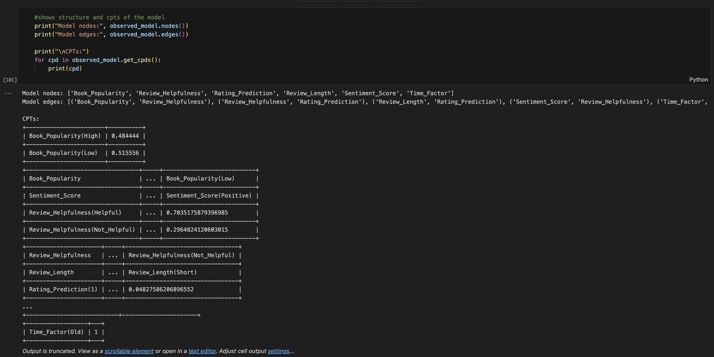
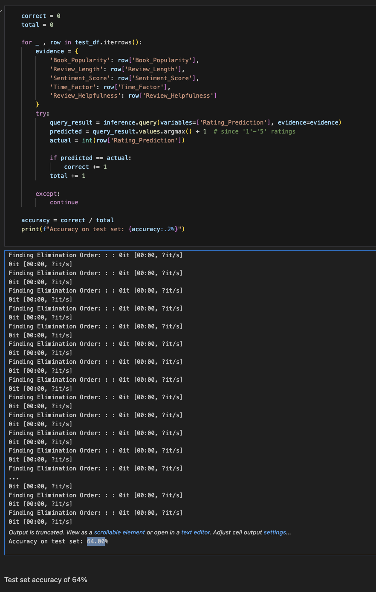

# README

Link to Dataset
https://www.kaggle.com/datasets/mohamedbakhet/amazon-books-reviews

## PEAS 

| Component        | Description                                                                                                                                                                                                                                                                                  |
|------------------|----------------------------------------------------------------------------------------------------------------------------------------------------------------------------------------------------------------------------------------------------------------------------------------------|
| **Performance Measure** | By determining the accuracy of the trained model on a subset of the dataset (the test data) |
| **Environment**         | The agent operates within an Amazon Books Review Dataset, which contains ~3GB of historical review data with millions of user reviews and book metadata. This environment is static and partially observable, since user profiles and reading histories are incomplete.                            |
| **Actuators**           | The agent’s actuators produce predictions and recommendations, including: - Rating predictions on a 1–5 star scale. - Helpfulness scores classifying reviews as "helpful" or "not helpful" along with probability estimates.                         |
| **Sensors**             | The agent receives input from multiple modalities: - *Review features:* Text length, sentiment, rating, timestamp. - *Social features:* Helpfulness votes, total rating counts indicating popularity and credibility.                                          |

---

### Problem  
Online book platforms face a major challenge: predicting which books users will rate highly and which reviews will be most helpful to other customers. With millions of books available, customers rely heavily on ratings and reviews to make purchasing decisions, but not all reviews are equal. This creates a complex recommendation environment where platforms must navigate uncertainty about user preferences while ensuring that the most valuable reviews are highlighted to aid customer decision-making.

### Why Uncertainty Modeling is Important  
Uncertainty modeling is needed for this problem because the data inherently contains multiple sources of uncertainty that significantly impact prediction accuracy. Most users only review a small fraction of the books they read, creating uncertainty about their true preferences and reading patterns. In addition, reading preferences vary greatly between individuals based on genre preferences, reading experience, and personal taste, making it difficult to generalize from limited user data. Some reviews are more informative and helpful than others, but this helpfulness depends on multiple factors, including the reviewer's expertise, writing quality, and the relevance of their perspective to other readers.  Additionally, we often lack complete information about user demographics, reading history, or the context in which they read specific books, creating additional layers of uncertainty that must be modeled probabilistically.

# Agent Setup, Data Preprocessing, Training Setup
## Key Variables
- **Rating_Prediction:** Target variable representing the rating a user gives to a book, on a scale from 1 to 5 stars.
- **Book_Popularity:** Observable variable derived from the total ratings count, indicating popularity levels (e.g., Low, High).
- **Review_Length:** Categorized by length of text into Short, Medium, or Long.
- **Sentiment_Score:** Used keywords such as "good", "great", "bad" to classify into Positive, Negative, or Neutral.
- **Time_Factor:** The time since the review and grouped into Recent and Old. 
- **Review_Helpfulness:** Found a helpfulness ratio, and then if positive then was deemed "Helpful". "Not_Helpful" if not.

  
## Connections

- Book_Popularity → Review_Helpfulness
Assumes that more popular books are likely to have more helpful reviews, either due to visibility or larger audiences voting on helpfulness.

- Review_Helpfulness → Rating_Prediction
Suggests that reviews marked as helpful may correspond to more thoughtful ratings, impacting the predicted score.

- Review_Length → Rating_Prediction
Suggests that longer length correlates with stronger user opinions, which may correlate with the given rating.

- Sentiment_Score → Review_Helpfulness
Suggests that the sentiment of the review (positive, negative, neutral) might affect whether other users find it helpful, such as clearly positive or negative reviews may be perceived as more informative.

- Time_Factor → Sentiment_Score
Assumes that the sentiment of reviews might shift over time with potential changes in trends on the book.

## Parameter Calculation Process

**Conditional Probability Tables (CPTs)** are estimated using **Maximum Likelihood Estimation (MLE)**.    

# Train Your Model!

---

# Conclusion / Results 

### Model Summary

- Bayesian Network structure:

Book_Popularity → Review_Helpfulness → Rating_Prediction

Review_Length → Rating_Prediction

Time_Factor → Sentiment_Score → Review_Helpfulness

- Trained on 1000 samples with Maximum Likelihood Estimation.

### Numerical Results

- Test Set Accuracy of 64%
- Random would be approximately 20%
- Even just purely using the majority Rating (5) would be around 57 percent. 

---

# Interpretation

- Ratings are skewed towards higher values regardless of popularity, reflecting the real-world tendency of positive review bias.
- There does seem to be a conditional dependence between Rating_Prediction and both Review_Helpfulness and Review_Length.
- Compared to a baseline of guessing the most common value, the model is predictive.  

---

# Points of Improvement

1. **Feature Changes:**
   - Rethinking some of the edges between the various nodes is a subjective thing, though. 
   - Consider adding in hidden variables to see if there are unobserved influences.

2. **Increasing amount of data set**
   - Expanding the size of the data set will have to be balanced with practicality. 

---

# References

- [pgmpy Documentation](https://pgmpy.org/)
